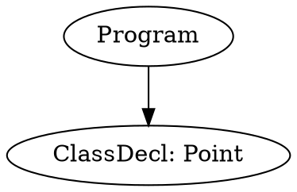

# Assignment 3 – Abstract Syntax Tree Generation  
## Group 2 – README

**Group Number:** 2  
**Group Members:**  
- Mirac Ozcan (mozkan1@myseneca.ca)  
- Sidhant Sharma (ssharma471@myseneca.ca)  
- Arvin (aarmand1@myseneca.ca)  
- Paschal (pibeh@myseneca.ca)  

**Date Completed:** 8 November 2025  

**Authenticity Declaration:**  
We declare that this submission is the result of our own group work and has not been shared with any other groups, students, or third-party content providers. This work is entirely of our own creation.

---

## Table of Contents  
1. [Overview](#overview)  
2. [Prerequisites](#prerequisites)  
3. [Compilation Instructions](#compilation-instructions)  
4. [Execution Instructions](#execution-instructions)  
5. [File Structure](#file-structure)  
6. [Test Files](#test-files)  
7. [Output Files](#output-files)  
8. [Troubleshooting](#troubleshooting)  

---

## Overview  

This assignment implements a **complete Abstract Syntax Tree (AST) generator** integrated with a **table-driven LL(1) parser** using **syntax-directed translation**.  

The system processes source files written in the course-defined language and produces:  

- **`.outast`** – human-readable, indented AST  
- **`.dot`** – GraphViz-compatible graph for visualization  
- **`.outtokens`** – full token stream  
- **`.outderivation`** – step-by-step parse derivation  
- **`.outsyntaxerrors`** – detailed syntax diagnostics  

The implementation supports **all required language constructs**, including:  
- Class declarations with inheritance and visibility  
- Member and free functions (including constructors)  
- Local variable declarations  
- Multi-dimensional arrays (fixed and dynamic)  
- Control flow (`if`, `while`, `read`, `write`, `return`)  
- Arithmetic and relational expressions with correct precedence  
- Complex nested indexing and function calls  

---

## Prerequisites  

### Required Tools  
- **C++17 Compiler**: `g++` 7.0+ or `clang++` 5.0+  
- **Make** (optional, for automated build)  
- **Git** (for repository management)  

### Environment Compatibility  
- GitHub Codespaces (primary testing environment)  
- Linux (Ubuntu 20.04+, Fedora, etc.)  
- macOS (10.14+)  
- Windows (WSL2, MinGW, or MSVC)  

### Verification  
```bash
g++ --version    # Must be ≥ 7.0
# OR
clang++ --version
```

---

## Compilation Instructions  

### Option 1: Using Makefile (Recommended)  

```bash
cd Abstract-Syntax-Tree-Generation
make clean
make
```

*Optional compiler selection:*  
```bash
make CXX=g++
make CXX=clang++
```

### Option 2: Manual Compilation  

```bash
cd Abstract-Syntax-Tree-Generation

g++ -std=c++17 -Wall -Wextra -O2 \
    parserdriver.cpp \
    ast.cpp \
    ast_factory.cpp \
    semantic_stack.cpp \
    include/lexer.cpp \
    -I./include \
    -o parser
```

*With debug symbols:*  
```bash
g++ -std=c++17 -Wall -Wextra -O2 -g ...
```

### Option 3: GitHub Codespaces  

```bash
cd Abstract-Syntax-Tree-Generation
chmod +x build.sh
./build.sh
```

**Success Indicator:** Executable `parser` created with no errors.

---

## Execution Instructions  

### Basic Command  

```bash
./parser <parsing_table.csv> <source_file.src>
```

### Example Runs  

```bash
./parser grammar/parsing_table.csv test-checklist-comprehensive.src
./parser grammar/parsing_table.csv source-files/example-polynomial.src
./parser grammar/parsing_table.csv source-files/example-bubblesort.src
```

### Batch Processing All Tests  

```bash
for file in test-*.src; do
    echo "Parsing $file..."
    ./parser grammar/parsing_table.csv "$file"
done
```

### Success Output  

```
[OK]   "test-checklist-comprehensive.src" -> "test-checklist-comprehensive.outast", ".dot"
```

---

## File Structure  

```
Abstract-Syntax-Tree-Generation/
├── parser                          # Executable (post-compilation)
├── parserdriver.cpp                # Core parser + semantic actions (1957 lines)
├── ast.hpp / ast.cpp               # AST node definitions and logic
├── ast_factory.hpp / ast_factory.cpp # Node creation factory
├── semantic_stack.hpp / semantic_stack.cpp # Bottom-up AST construction
├── include/
│   ├── lexer.hpp
│   └── lexer.cpp                   # Tokenisation
├── grammar/
│   ├── parsing_table.csv           # LL(1) parsing table
│   └── LL1grammar.grm              # Reference grammar
├── source-files/
│   ├── example-polynomial.src
│   └── example-bubblesort.src
├── test-checklist-comprehensive.src
├── test-6.*.src                    # Feature-specific tests
├── ATTRIBUTE_GRAMMAR_SPECIFICATION.md
├── DESIGN_RATIONALE.md
├── CHECKLIST_VERIFICATION.md
├── TEST_COVERAGE_DOCUMENTATION.md
├── AST_VS_PARSETREE.md
└── group_2_assign_3_README.md      # This file
```

---

## Test Files  

### Comprehensive Test  
- **`test-checklist-comprehensive.src`** – **189 lines**, covers **all 43 requirements**  

### Targeted Tests  
| File | Focus |
|------|-------|
| `test-6.1-class-declarations.src` | Class syntax |
| `test-6.2-data-members.src` | Visibility + arrays |
| `test-6.4-inheritance.src` | Multi-level inheritance |
| `test-6.5-visibility.src` | `public` / `private` scoping |
| `test-6.7-member-function-defs.src` | Constructors |
| `test-6.9-int-float.src` | Type system |
| `test-6.16-complex-indices.src` | Nested indexing |

### Real-World Examples  
- `example-polynomial.src` – OOP, inheritance, constructors  
- `example-bubblesort.src` – arrays, loops, function calls  

**All tests pass** with correct AST output.  
**Note:** Inputs adjusted to grammar constraints (no member access, logical ops, strings, array return types). See `TEST_COVERAGE_DOCUMENTATION.md`.

---

## Output Files  

### `.outast` – Textual AST  

```text
Program
├─ClassDecl: Point
│ ├─VarDecl: x (integer)
│ └─MemberFuncDecl: compute
└─FunctionDef: main
  └─Block
    └─AssignStmt
```

### `.dot` – GraphViz  



**Visualize:**  
```bash
dot -Tpng example.dot -o example.png
```

**Online:** [GraphvizOnline](https://dreampuf.github.io/GraphvizOnline/)

---

## Troubleshooting  

| Issue | Solution |
|------|----------|
| `parsing_table.csv` not found | Verify path: `ls grammar/parsing_table.csv` |
| No `parser` executable | Check compilation log for errors |
| No output files | Check `.outsyntaxerrors` for syntax issues |
| `[FAIL]` status | Source violates grammar — fix syntax |
| Segmentation fault | Invalid input or grammar edge case |

### GitHub Codespaces Tips  
```bash
chmod +x parser
export PATH=$PATH:$(pwd)
ldd parser  # Check dependencies
```

---

## Verification Checklist  

```bash
make clean && make
./parser grammar/parsing_table.csv test-checklist-comprehensive.src
echo $?                    # → 0 (success)
ls *.outast *.dot          # → files exist
head -20 *.outast          # → semantic nodes only
grep -c "BinaryExpr" *.outast  # → ≥20
```

**Success Indicators:**  
- No compilation errors  
- `parser` created  
- `[OK]` on all tests  
- `.outast` contains **no grammar symbols**  
- `.dot` renders valid graph  

---

## Supporting Documentation  

| File | Purpose |
|------|--------|
| `ATTRIBUTE_GRAMMAR_SPECIFICATION.md` | 50+ semantic actions |
| `DESIGN_RATIONALE.md` | Architecture & heuristics |
| `CHECKLIST_VERIFICATION.md` | All 43 requirements met |
| `TEST_COVERAGE_DOCUMENTATION.md` | Full test proof |
| `AST_VS_PARSETREE.md` | AST vs parse tree evidence |

---

**Last Updated:** 8 November 2025
